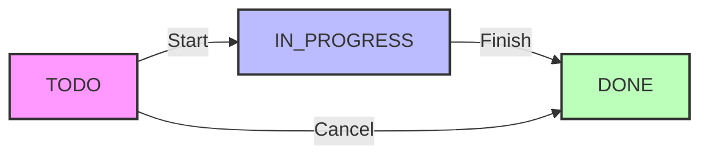
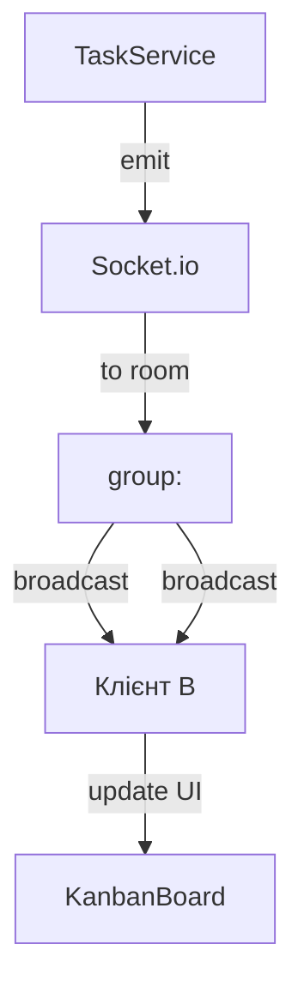

# 3.3. Бізнес‑логіка системи та автоматизація

**У процесі проектування бізнес‑логіки** системи управління задачами було обрано підхід, орієнтований на **чітко визначений життєвий цикл задач**, їх **пріоритети**, **залежності**, а також **правила автоматизації** у вигляді *If‑Then*‑тригерів. Така модель забезпечує **централізований контроль** за станом робочого процесу, гарантує **консистентність даних** під час одночасних змін і дозволяє **мгновено інформувати** всіх учасників про події у реальному часі.

---

## 3.3.1. Життєвий цикл задач (статуси, пріоритети)

### 3.3.1.1. Статуси задач
У системі визначено **три основних статуси** – це **енумерація `TaskStatus`**, що формалізує етапи виконання задачі:
- `TODO` – задача створена, ще не розпочата;
- `IN_PROGRESS` – задача перебуває у процесі виконання;
- `DONE` – задача завершена.

Статуси зберігаються в колонці `status` таблиці `Task`. Перехід між статусами **дозволений лише згідно з визначеною матрицею переходів** (state‑machine). Спроба здійснити заборонений перехід (наприклад, `DONE → TODO`) викликає виключення `INVALID_STATUS_TRANSITION`, яке транслюється у фронтенд у вигляді HTTP‑коду 400.

#### Діаграма станів (State‑Machine)

Дана діаграма ілюструє **дозволені переходи** та підкреслює, що після `DONE` задача не може повернутись у попередній статус.

### 3.3.1.2. Пріоритети задач
Пріоритети (`LOW`, `MEDIUM`, `HIGH`) зафіксовано у **enum `TaskPriority`**. Вони використовуються у:
1. **Фільтрації** та **сортуванні** на Kanban‑дошці (високі пріоритети – у верхній частині стовпців);
2. **Правилах автоматизації**, коли, наприклад, задача високого пріоритету автоматично піднімається у стан `IN_PROGRESS` за 48 годин до терміну;
3. **Аналітичних звітах** – середній час виконання задач різних пріоритетів.

---

## 3.3.2. Управління залежностями задач та їх модель

### 3.3.2.1. Сутність `TaskDependency`
Для опису **залежностей** використано окрему таблицю `TaskDependency` з полями `taskId` (задача, яка залежить) та `dependsOnId` (задача‑попередник). Така модель дозволяє будувати **довільний орієнтований граф** зависимостей, у якому вершинами є задачі, а ребрами – залежності.

### 3.3.2.2. Перевірка циклічних залежностей
Перед збереженням нової залежності `TaskService` виконує **глибокий пошук у графі** (DFS) з метою виявлення **циклів**. Якщо під час обходу знаходиться вже відвідана вершина, операція припиняється і генерується виключення `CYCLIC_DEPENDENCY`. Це запобігає ситуаціям, коли задача не може бути завершена через взаємно блокуючі залежності.

#### Алгоритм детекції циклу (псевдокод)
```
function hasCycle(taskId, visited, recStack):
    visited.add(taskId)
    recStack.add(taskId)
    for each neighbor in dependencies[taskId]:
        if not visited.contains(neighbor):
            if hasCycle(neighbor, visited, recStack): return true
        else if recStack.contains(neighbor):
            return true
    recStack.remove(taskId)
    return false
```
Якщо `hasCycle` повертає `true`, нова залежність відхиляється.

---

## 3.3.3. Тайм‑трекинг та автоматизація (правила If‑Then)

### 3.3.3.1. Тайм‑трекинг у сутності `Task`
Крім базових полів (`title`, `description`, `status`), таблиця `Task` містить часові маркери:
- `dueDate` – кінцевий термін;
- `startedAt` – час переходу у `IN_PROGRESS` (установлюється автоматично при першому переході);
- `completedAt` – час переходу у `DONE`;
- `duration` – розрахований (virtual) поле, що визначається як `completedAt - startedAt`.

Ці дані використовуються для **генерації звітів** (наприклад, середній час виконання задач за групою, проєктом або пріоритетом) та **додаткових перевірок** у правилах автоматизації.

### 3.3.3.2. Правила автоматизації (If‑Then)
Система підтримує **правила у вигляді простих умовних виразів**, які зберігаються у таблиці `AutomationRule` (або у файлі `automation.yaml`). Кожне правило має наступну структуру:
```yaml
- id: rule-001
  description: "Перенести високопріоритетну задачу в IN_PROGRESS, якщо залишилося < 48 годин"
  condition: "task.priority == 'HIGH' && task.dueDate <= now() + 48h"
  action: "set task.status = 'IN_PROGRESS'"
```
**`AutomationService`** періодично (за розкладом, наприклад, кожні 5 хвилин) зчитує активні правила, формує **SQL‑запит**, який вибирає задачі, що задовольняють умові, і застосовує вказану дію. Після успішної трансформації генерується **подія `task:automated`**, яка передається у реальному часі всім підключеним клієнтам.

### 3.3.3.3. Технічна реалізація
1. **Парсер умов** – реалізовано за допомогою бібліотеки `jsep` (JavaScript Expression Parser). Умовний рядок розбирається у абстрактне синтаксичне дерево (AST).
2. **Виконання дії** – після успішної оцінки умов AST, у сервіси передається об’єкт `TaskUpdateDto`, який містить потрібні поля (`status`, `priority`).
3. **Транзакція** – оновлення задачі та генерація події виконуються в одній транзакції `prisma.$transaction`, що гарантує атомарність.

---

## 3.3.4. Реалізація подій у реальному часі через Socket.io

### 3.3.4.1. Потік подій
Кожна суттєва зміна в домені задач (створення, оновлення, видалення, автоматичний перехід) генерує **socket‑подію**. Події надсилаються лише користувачам, які перебувають у **кімнаті групи** (`group:<groupId>`), до якої належить задача. Це мінімізує мережевий трафік і забезпечує **консистентність UI** на всіх клієнтах.

#### Список подій
| Подія | Опис | Параметри | Кому розсилається |
|-------|------|-----------|-------------------|
| `task:created` | Створено нову задачу | `{ task }` | Учасникам групи, власнику задачі |
| `task:updated` | Оновлено поля (статус, пріоритет, термін) | `{ task }` | Учасникам групи |
| `task:deleted` | Видалено задачу | `{ taskId }` | Учасникам групи |
| `task:automated` | Автоматичний перехід, викликаний правилом If‑Then | `{ task, ruleId }` | Учасникам групи |

### 3.3.4.2. Архітектура подій

Діаграма показує, що після зміни в `TaskService` відбувається **емісія** події у `Socket.io`, яка **транспортує** дані у всіх підключених клієнтів, що належать до відповідної групи.

### 3.3.4.3. Обробка подій на клієнті
На фронтенді події підписуються у файлі `src/socket.ts`. При отриманні події функції з Zustand‑store (`useTaskStore`) **мутують** стан, що автоматично оновлює UI без додаткових HTTP‑запитів.

---

## 3.3.5. Безпека бізнес‑логіки та контролю доступу

### 3.3.5.1. Перевірка прав у сервісах
Усі методи `TaskService` отримують `userId` з контексту запиту (заповненого `authGuard`). Перед виконанням операції виконується **перевірка ролі** через `roleGuard`. Наприклад, лише користувачі з роллю `ADMIN` або `MANAGER` можуть **видаляти** задачі, а `USER` – лише **переглядати** та **оновлювати** власні задачі.

### 3.3.5.2. Захист від гонок (race conditions)
Для уникнення одночасних конфліктних оновлень використано **optimistic concurrency control** – у таблиці `Task` додано колонку `version` (int). При кожному оновленні `version` інкрементується, а SQL‑запит включає умову `WHERE version = :expected`. Якщо оновлення не потрапляє, генерується виключення `CONFLICT_ERROR`, яке клієнт обробляє, запитуючи свіжі дані.

---

## 3.3.6. Підсумкові висновки
- **Статуси та пріоритети**, визначені у типізованих enum‑ах, формують уніфіковану модель задач, що спрощує їхню обробку у бекенді та фронтенді.
- **Залежності задач** реалізовано через орієнтовану графову структуру, а алгоритм виявлення циклічності гарантує **коректність** робочих процесів.
- **Тайм‑трекинг** (полі `startedAt`, `completedAt`, `duration`) дозволяє будувати аналітику та підтримує **правила автоматизації**, які спираються на часові параметри.
- **AutomationEngine** у вигляді `AutomationService` забезпечує **динамічний, конфігурований** механізм *If‑Then*, що суттєво знижує навантаження користувачів, автоматично переводячи задачі у потрібні стани.
- **Socket.io** слугує каналом **real‑time** обміну подіями, гарантуючи **однорідність UI** на всіх клієнтах і мінімізуючи дублювання запитів.
- **Контроль доступу** (JWT, RBAC, optimistic concurrency) забезпечує **надійність** та **захист** від несанкціонованих змін.

У підсумку, бізнес‑логіка системи «Task Manager» представлена у вигляді **модульної, типізованої та поділеної на сервіси архітектури**, що відповідає вимогам **масштабованості**, **продуктивності**, **безпеки** та **автоматизації робочих процесів**. Це створює міцну основу для подальшого розширення функціональності та інтеграції з зовнішніми системами.
